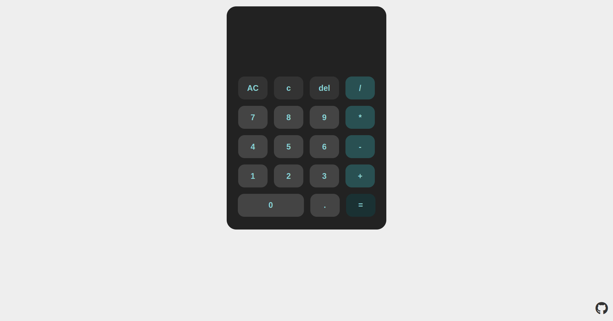

# Calculator

A simple calculator created with html, css and js

## About the app

The project is from [The Odin Project](https://www.theodinproject.com/lessons/foundations-calculator) curriculum.

### Tools and technology

- Visual Studio Code
- Linux Terminal
- Font Awesome Icons
- Git and GitHub
- HTML and CSS
- JavaScript

## Screenshot

## Author

[Sergio García](https://github.com/sergiogarciiam)

## License

This project is open source and available under the [MIT License](./LICENSE).
